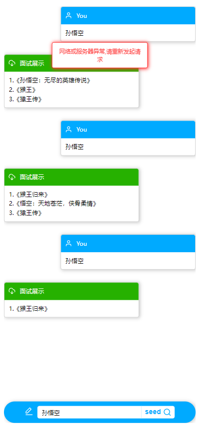

# chat

前端笔试

## 依赖的库

[vue-github](https://github.com/vuejs/vue)
[axios-github](https://github.com/axios/axios)

## 参考资料

[ 打字机 => /chat ](https://blog.csdn.net/qq_36521848/article/details/130272999)

​    因为`/chat`返回的内容为对象类型，处理起来不方便，所以用的是`/send`，并且改了一些代码，以实现`/chat`的效果

[axios教程](https://blog.csdn.net/weixin_40017062/article/details/131810859)

​    一开始看的是[EventSource](https://blog.csdn.net/qq_29866553/article/details/127408993),但是这个必须要用get接口，而需要传的数据是`{"message":"孙悟空"}` Object类型的数据。所以我用的是`axios`的post接口。


## 执行效果
### 正确执行

输入字符后，点击提交按钮，此时输入框和按钮会被`disable`，禁止短时间内传多个数据，直至返回结果或者超时。


每得到一条数据都会以/chat的形式展示出来，得到3条数据后结束此次查询。


### 输入字符长度大于6时

这里我用的是前端拦截，在已知`当输入人物名字超过6个字时，服务器会返回413 错误`时，用前端拦截更方便，也能减少服务器负担。

输入字符长度大于6，提交时，会弹出警告提示框。


### 长时间服务器无响应时

每提交一次，都会发出多个post请求，当返回`429错误`或者`500错误`时，都会记录下来。

当返回错误的次数大于等于`10`次时，即为服务器无响应。弹出`服务器无响应`提示框。



## 项目初始化

将项目下载到本地后，进入项目文件夹，在终端执行以下代码：
```sh
npm install
npm install axios --save
```


## 项目执行

项目启动，在终端执行以下代码：
```sh
npm run dev
```

启动成功后，浏览器打开：`http://localhost:5173/`

因为本项目没有对宽度进行约束，所以建议按`F12`再按` ctrl+shift+M` 进入手机视图，或者通过`F12`缩小浏览器视图，以获得最佳浏览体验。


